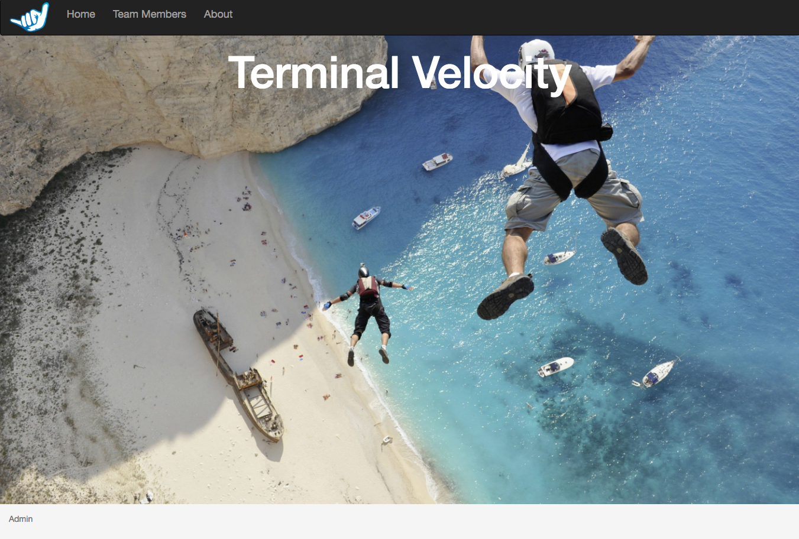
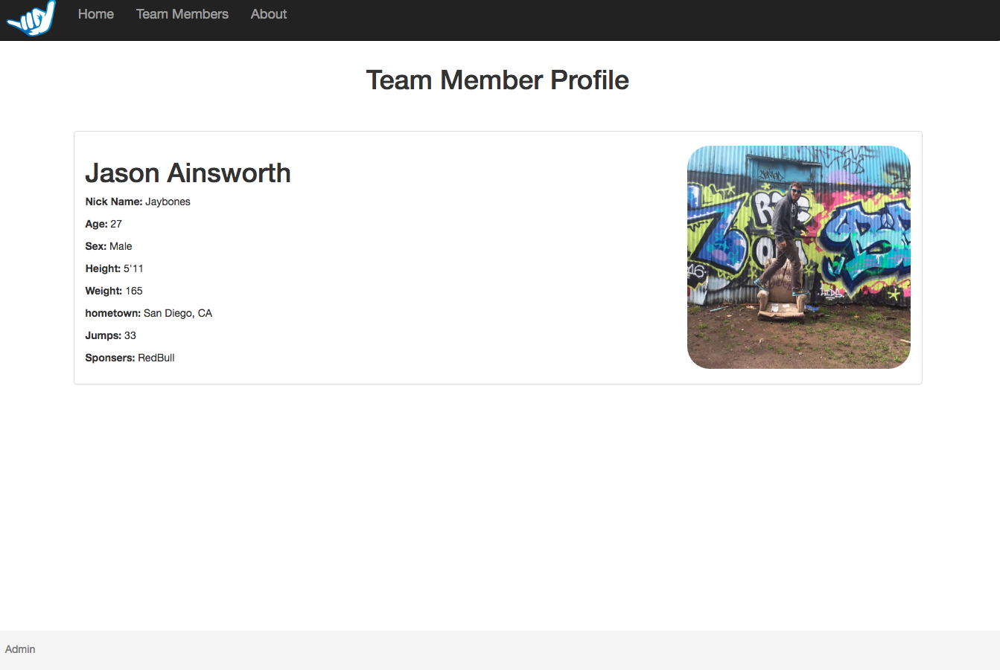

# Terminal Velocity

This is website for the fictional skydiving team called Terminal Velocity. The site keeps track of all the team members and displays a profile page for each member with their stats. It has an admin section for the site administrator that implements full CRUD ability. Users have the ability to filter members based on their sponsor.

## Future Updates
* Section for announcements
* Message board for members
* Blog

## Prerequisites
* [Git](https://git-scm.com/)
* [Angular CLI](https://angularjs.org/)
* [Bower](https://bower.io/)
* [NPM](https://www.npmjs.com/)
* [Firebase](https://firebase.google.com/)
* You'll need to signup for a free account with firebase and create a file in the top level of the project directory called 'api-keys.ts'. Once you are logged in, hit the button that says 'get started' and then 'add project'. Then click 'add firebase to your web app'. Copy 'var config' and everything inside it and paste that inside your newly created api-keys.ts file. Rename 'config' to 'masterFirebaseConfig'. Make sure to include your api-keys.ts file in the .gitignore file so you api key does not become public.

## Installation
* run the following commands in the terminal
* `git clone https://github.com/jaybones90/terminal-velocity.git`
* `cd terminal-velocity`
* `npm install`
* `bower install`

## Development server

Run `ng serve` for a dev server. Navigate to `http://localhost:4200/`. The app will automatically reload if you change any of the source files.

## Known Bugs
There are no known bugs at this time. Please feel free to send me an email or comment on my github if you come across any bugs.

## Contact Info
* Jason Ainsworth
* Email: jasoncruze@gmail.com
* Github: https://github.com/jaybones90

## License
MIT © Jason Ainsworth 2017

